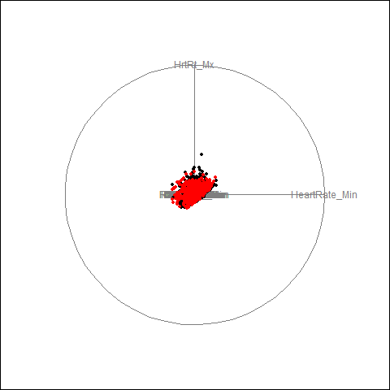
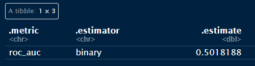
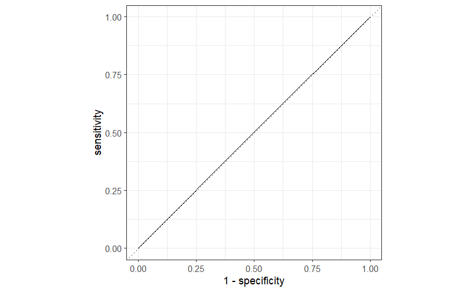
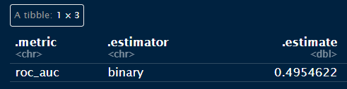
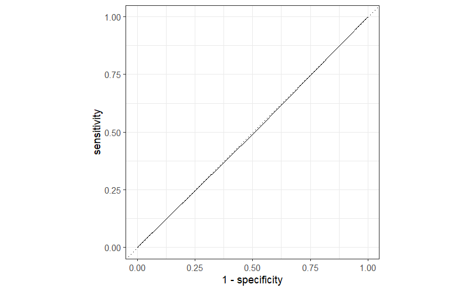
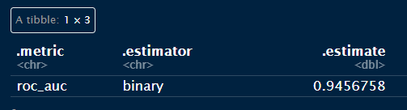
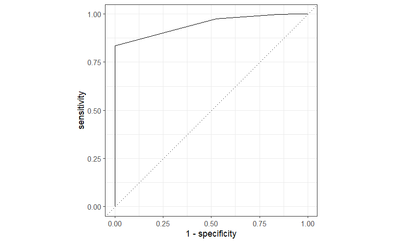
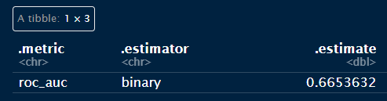
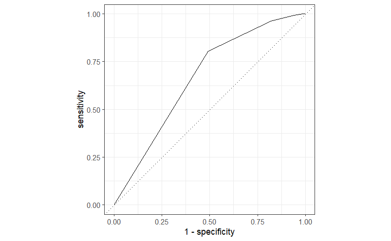
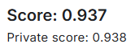

```{r, echo=FALSE}
knitr::opts_chunk$set(message = FALSE, warning = FALSE)
```

```{r seed setup, eval=TRUE}
#cur_seed <- Sys.time() |> as.integer()
cur_seed <- 1779536630
set.seed(cur_seed)
keras3::set_random_seed(cur_seed)
#writeLines(cur_seed |> as.character(), "R_objects/seed.txt")
```

# Data

```{r}
library(tidyverse)
library(tidymodels)

columns_to_remove <- c(
  "subject_id", "hadm_id", "icustay_id", "DIAGNOSIS", "ICD9_diagnosis", "DOB",
  "ADMITTIME", "Diff"
)

train_X <- read_csv("train_X.csv")
train_y <- read_csv("train_y.csv")
test_X <- read_csv("test_X.csv")
MIMIC_metadata_diagnose <- read_csv("MIMIC_metadata_diagnose.csv")
MIMIC_diagnoses <- read_csv("MIMIC_diagnoses.csv") |> janitor::clean_names()
```

I removed all the IDs and date variables. I also removed `DIAGNOSIS` and `ICD9_diagnosis` because I couldn't find a way to use them because they were more than 4000 different string values. As a result, the 2 classes could not be easily distinguished:



The full diagnoses are in `MIMIC_diagnoses.csv`, so for the pre-processing, I did a `left_join()` of `train_X` with `MIMIC_diagnoses`, followed by `pivot_wider()` to ensure all diseases are in 1 row, and then applied one-hot encoding.

```{r, echo=TRUE}
combined_XY <- left_join(train_X, train_y) |>
  left_join(MIMIC_diagnoses) |>
  select(-seq_num) |>
  mutate(from_data = 1)

test_X <- test_X |>
  left_join(MIMIC_diagnoses) |>
  select(-seq_num) |>
  mutate(HOSPITAL_EXPIRE_FLAG = NA, from_data = 2)

merged_for_multi_hot_encode <- rbind(combined_XY, test_X)
```

I merged the train and test data to make sure that the train and test matrix have the same dimension (The 2 matrices having different dimensions will happen due to them having different ICD9 codes, which will cause dimension mismatches).

```{r, echo=TRUE}
multi_hot_encode <- function(df) df |> # This function is used for the ICD9 codes
  mutate(value = 1) |>
  pivot_wider(
    names_from = icd9_code,
    values_from = value,
    values_fill = 0,
    values_fn = max,
    names_prefix = "ICD9_code_"
  )

one_hot_encode <- function(df) { # This function is used for other categorical columns
  # Identify numeric and categorical columns
  num_cols <- sapply(df, is.numeric)
  cat_cols <- !num_cols
  
  # Convert categorical columns to factors
  df[cat_cols] <- lapply(df[cat_cols], as.factor)
  
  # One-hot encode categorical columns only
  dummy_matrix <- model.matrix(~ . - 1, data = df[cat_cols])
  
  # Combine untouched numeric columns with encoded columns
  final_df <- cbind(df[num_cols], as.data.frame(dummy_matrix))
  final_df
}

encoded_data <- merged_for_multi_hot_encode |>
  multi_hot_encode() |>
  select(-columns_to_remove) |>
  one_hot_encode()

combined_XY <- encoded_data |>
  filter(from_data == 1) |>
  select(-from_data)

test_X <- encoded_data |>
  filter(from_data == 2) |>
  select(-c(from_data, HOSPITAL_EXPIRE_FLAG))

rm(encoded_data)
```

After pre-processing, I split the train data to even smaller train and test sets for my own use, because the Kaggle submission had a limit of 4 per day.

```{r}
train_test_split <- rsample::initial_split(combined_XY, 0.8, strata = HOSPITAL_EXPIRE_FLAG)
train_data <- rsample::training(train_test_split)
test_data <- rsample::testing(train_test_split)
```

In the upcoming model evaluation results, all results will be on the **small** train and test sets, as there is the true class result in them for validation.

# Logistic regression

```{r, eval=FALSE}
log_model <- logistic_reg() |>
  set_engine("glm") |>
  set_mode("classification")
log_fit <- fit(
  log_model,
  HOSPITAL_EXPIRE_FLAG ~ .,
  train_data |> mutate(HOSPITAL_EXPIRE_FLAG = as.factor(HOSPITAL_EXPIRE_FLAG))
)
```

## In-sample ROC AUC




## Out-of-sample ROC AUC




For some reason, the logistic regression model gave really bad results, both in and out of sample. The model took 2 hours to finish fitting.

# KNN

I fitted a KNN model with **k = 5**:

```{r, eval=FALSE}
knn_test_model <- nearest_neighbor(
  neighbors = 5, weight_func = "rectangular", dist_power = 2
) |>
  set_engine("kknn") |>
  set_mode("classification")
knn_fit <- fit(
  knn_test_model,
  HOSPITAL_EXPIRE_FLAG ~ .,
  train_data |> mutate(HOSPITAL_EXPIRE_FLAG = as.factor(HOSPITAL_EXPIRE_FLAG))
)
```

## In-sample ROC AUC




## Out-of-sample ROC AUC




The KNN model has overfit the training data. The model took 1 hour to fit, and the prediction results for the train and test set took 1 hour each to run (So 3 hours in total for this model).

# Decision tree

```{r}
tree_model <- decision_tree(
  min_n = 200, tree_depth = 6, cost_complexity = 0.001
) |>
  set_engine("rpart") |>
  set_mode("classification")
tree_fit <- fit(
  tree_model,
  HOSPITAL_EXPIRE_FLAG ~ .,
  train_data |> mutate(HOSPITAL_EXPIRE_FLAG = as.factor(HOSPITAL_EXPIRE_FLAG))
)
```

# In-sample ROC AUC

```{r, echo=FALSE}
train_res <- bind_cols(
  train_data |> select(HOSPITAL_EXPIRE_FLAG),
  predict(tree_fit, train_data),
  predict(tree_fit, train_data, type = "prob")
) |>
  mutate(HOSPITAL_EXPIRE_FLAG = as.factor(HOSPITAL_EXPIRE_FLAG))

roc_auc(train_res, HOSPITAL_EXPIRE_FLAG, .pred_0)
roc_curve(train_res, HOSPITAL_EXPIRE_FLAG, .pred_0) |> autoplot()
```

# Out-of-sample ROC AUC

```{r, echo=FALSE}
test_res <- bind_cols(
  test_data |> select(HOSPITAL_EXPIRE_FLAG),
  predict(tree_fit, test_data),
  predict(tree_fit, test_data, type = "prob")
) |>
  mutate(HOSPITAL_EXPIRE_FLAG = as.factor(HOSPITAL_EXPIRE_FLAG))

roc_auc(test_res, HOSPITAL_EXPIRE_FLAG, .pred_0)
roc_curve(test_res, HOSPITAL_EXPIRE_FLAG, .pred_0) |> autoplot()
```

The simple decision tree model took much faster to fit and run (about 5 minutes).
The performance was also much better compared to logistic regression and KNN. However, the AUC result was not satisfactory.

# Neural network (the winner)

```{r}
library(keras3)

NN_model <- keras_model_sequential()
NN_model |>
  layer_dense(units = 1000, activation = "relu", input_shape = ncol(train_data) - 1) |>
  layer_dense(units = 400, activation = "relu") |>
  layer_dense(units = 20, activation = "relu") |>
  layer_dense(units = 1, activation = "sigmoid")

NN_model |> compile(
  optimizer = "adam",
  loss = loss_binary_focal_crossentropy(),
  metrics = list(metric_auc())
)
```

The neural network has 4 layers, with the last layer having a sigmoid activation function (due to this being a binary classification project). The loss function used was `loss_binary_focal_crossentropy()` because of the imbalance of the 2 classes.

```{r}
# Turn the data into matrix form for keras3::fit()
NN_train_X <- train_data |>
  select(-HOSPITAL_EXPIRE_FLAG) |>
  as.matrix()
NN_train_y <- train_data$HOSPITAL_EXPIRE_FLAG

NN_test_X <- test_data |>
  select(-HOSPITAL_EXPIRE_FLAG) |>
  as.matrix()
NN_test_y <- test_data$HOSPITAL_EXPIRE_FLAG
```

I also included an early stop to prevent overfitting for the neural network:

```{r}
early_stop <- callback_early_stopping(
  monitor = "val_auc",
  mode = "max",
  patience = 10,
  restore_best_weights = TRUE
)

NN_fit <- NN_model |> 
  keras3::fit(
    x = NN_train_X, 
    y = NN_train_y,
    validation_data = list(
      NN_test_X,
      NN_test_y
    ),
    epochs = 30,
    batch_size = 32, # default
    verbose = 0,
    callbacks = list(early_stop)
  )
summary(NN_model)
plot(NN_fit)
```

The fitting stopped after 27 epochs

# In-sample ROC AUC

```{r}
train_res <- train_data |>
  mutate(
    HOSPITAL_EXPIRE_FLAG = as.factor(HOSPITAL_EXPIRE_FLAG),
    pred_prob = 1 - predict(
      NN_model,
      NN_train_X
    )[,1],
    pred_class = round(1 - pred_prob) |> factor(levels = c(0, 1))
  ) |>
  select(HOSPITAL_EXPIRE_FLAG, pred_prob, pred_class)

roc_auc(train_res, HOSPITAL_EXPIRE_FLAG, pred_prob)
roc_curve(train_res, HOSPITAL_EXPIRE_FLAG, pred_prob) |> autoplot()
```

# Out-of-sample ROC AUC

```{r}
test_res <- test_data |>
  mutate(
    HOSPITAL_EXPIRE_FLAG = as.factor(HOSPITAL_EXPIRE_FLAG),
    pred_prob = 1 - predict(
      NN_model,
      NN_test_X
    )[,1],
    pred_class = round(1 - pred_prob) |> factor(levels = c(0, 1))
  ) |>
  select(HOSPITAL_EXPIRE_FLAG, pred_prob, pred_class)

roc_auc(test_res, HOSPITAL_EXPIRE_FLAG, pred_prob)
roc_curve(test_res, HOSPITAL_EXPIRE_FLAG, pred_prob) |> autoplot()
```

# Kaggle AUC score



The NN model did not take long to run (about 10 minutes, slightly longer than decision tree). The key step that helped this model to achieve good result was the merging of extra ICD9 codes into the main data (before that, the NN model could not pass 0.8 AUC score).